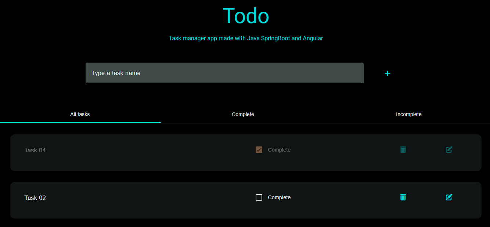
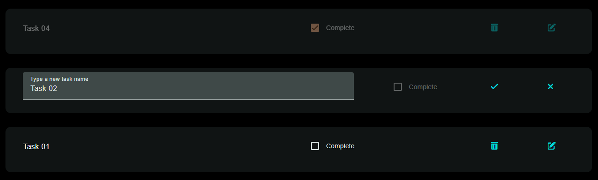

<h1 align="center">Todo-App with Java Spring and Angular 📋</h1>

<p align="center">
  
  
  
</p>

<p align="center" display="flex">






</p>

<h2>Technologies ⚙️</h2>

<h3>Frontend 🎨</h3>
<p>Built with Angular v18.1.2. I used Angular Material to include cool UI stuff.Little icons are from FontsAwesome</p>

<h3>Backend 🗄️</h3>
<p>Server built with Java Spring Boot, and DataBase built with PostGreSQL . Used Lombok to reduce boilerplate code  </p>

<h2>🚀 Getting Started</h2>


# Frontend

This project was generated with [Angular CLI](https://github.com/angular/angular-cli) version 18.1.2.

## Development server

<p>Make sure Angular is installed</p>
<p>cd frontend</p>
Run `ng serve` for a dev server. Navigate to `http://localhost:4200/`. The application will automatically reload if you change any of the source files.

## Code scaffolding

Run `ng generate component component-name` to generate a new component. You can also use `ng generate directive|pipe|service|class|guard|interface|enum|module`.

## Build

Run `ng build` to build the project. The build artifacts will be stored in the `dist/` directory.


## Further help

To get more help on the Angular CLI use `ng help` or go check out the [Angular CLI Overview and Command Reference](https://angular.dev/tools/cli) page.

# Backend

## Requirements

For building and running the application you need:

- [JDK 23]
- [Maven 4]

## Running the application locally

There are several ways to run a Spring Boot application on your local machine. One way is to execute the `main` method in the `TodoSpringAngularApplication` class from your IDE.

Alternatively you can use the [Spring Boot Maven plugin](https://docs.spring.io/spring-boot/docs/current/reference/html/build-tool-plugins-maven-plugin.html) like so:

```shell
mvn spring-boot:run
```
